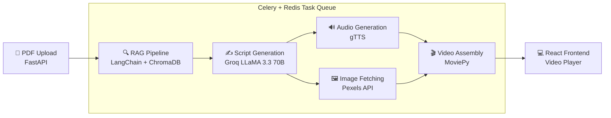

<div align="center">

# 🔬 PaperLens AI

### *Turn any PDF into a narrated explainer video — in minutes.*

**Reading long PDFs is time-consuming and boring.**
PaperLens AI converts any text-based PDF into a fully narrated, captioned explainer video using AI — making any document easy to understand for everyone.

[](https://python.org)
[](https://reactjs.org)
[](https://fastapi.tiangolo.com)
[](https://docs.celeryq.dev)
[](https://redis.io)
[](https://langchain.com)
[](https://groq.com)

---

**Built by [Rashmi Manani](https://github.com/rashmii2210)**

</div>

---

## 📑 Table of Contents

- [Who Is This For?](#-who-is-this-for)
- [Demo](#-demo)
- [How It Works](#-how-it-works)
- [Tech Stack](#%EF%B8%8F-tech-stack)
- [Project Structure](#-project-structure)
- [Getting Started](#-getting-started)
  - [Prerequisites](#prerequisites)
  - [Installation](#installation)
  - [Environment Variables](#environment-variables)
  - [Running the App](#running-the-app)
- [Generation Time](#%EF%B8%8F-generation-time)
- [Limitations](#%EF%B8%8F-limitations)
- [Contributing](#-contributing)
- [License](#-license)

---

## 👥 Who Is This For?

| User | Use Case |
|------|----------|
| 🎓 **Students** | Textbooks, lecture notes, assignments |
| 🔬 **Researchers** | Papers, journals, academic publications |
| 💼 **Professionals** | Reports, whitepapers, technical documentation |
| 🌍 **Everyone** | Any PDF you don't want to read manually |

---

## ✨ Demo

> Upload a PDF → AI reads it → generates a script → narrates it → assembles a captioned video.
> 
<p align="center">
  <strong>🔊 Note: Click the volume icon on the player to unmute the video narration!</strong>
</p>
<p align="center">
  <video src="https://github.com/user-attachments/assets/001631e4-8694-47ed-b480-9f8c241a3b96" width="500" autoplay loop controls playsinline></video>
</p>

**Sample Input/Output:**

**Input:** ["Attention Is All You Need"](https://arxiv.org/pdf/1706.03762) (Vaswani et al., 2017)

**Output:** ~3 min narrated explainer video with:
- ✅ Section title overlays (Introduction, Methodology, Discussion, Conclusion)
- ✅ Word-synced captions
- ✅ Relevant background images
- ✅ AI-generated voiceover

## 🧠 How It Works



**Pipeline breakdown:**

1. **PDF Upload** — User uploads any text-based PDF via drag-and-drop
2. **RAG Pipeline** — LangChain chunks the PDF, embeds with `sentence-transformers`, stores in ChromaDB
3. **Script Generation** — Groq's LLaMA 3.3 70B generates a YouTube-style explainer script per section
4. **Audio Generation** — Google TTS (gTTS) converts each section script to MP3
5. **Image Fetching** — Pexels API fetches relevant landscape images per section
6. **Video Assembly** — MoviePy composites images + audio + captions + title overlays into the final MP4
7. **Delivery** — FastAPI serves the video; the React frontend displays it with a download button

---

## 🛠️ Tech Stack

| Layer | Technology | Purpose |
|-------|-----------|---------|
| Frontend | React 18 | Drag-and-drop UI, progress tracking, video player |
| Backend | FastAPI + Uvicorn | REST API, file handling, video serving |
| Task Queue | Celery + Redis | Async video generation pipeline |
| RAG | LangChain + ChromaDB | PDF chunking, embedding, retrieval |
| Embeddings | sentence-transformers | Semantic search over PDF content |
| LLM | Groq (LLaMA 3.3 70B) | Script generation |
| TTS | gTTS (Google TTS) | Text-to-speech audio |
| Images | Pexels API | Contextual background images |
| Video | MoviePy + Pillow | Frame compositing, captioning, rendering |

---

## 📁 Project Structure

```
PaperLens-AI/
├── backend/
│   ├── main.py                 # FastAPI app — upload & status endpoints
│   ├── celery_worker.py        # Celery task — full pipeline orchestration
│   ├── script_generator.py     # RAG + LLM script generation
│   ├── tts_generator.py        # gTTS audio generation
│   ├── video_assembler.py      # MoviePy video compositing
│   ├── rag_pipeline.py         # PDF chunking & embedding
│   ├── requirements.txt        # Python dependencies
│   ├── .env.example            # Environment variable template
│   └── jobs/                   # Generated videos (git-ignored)
│
├── frontend/
│   ├── src/
│   │   ├── App.js              # Main React component
│   │   ├── components/
│   │   │   ├── Dropzone.js     # PDF drag-and-drop
│   │   │   ├── ProgressBar.js  # Pipeline progress steps
│   │   │   └── VideoPlayer.js  # Video player + download
│   │   └── index.js
│   └── package.json
│
├── .gitignore
└── README.md
```

---

## 🚀 Getting Started

### Prerequisites

- Python 3.10+
- Node.js 18+
- Docker Desktop (for Redis)
- Git

### Installation

**1. Clone the repository**

```bash
git clone https://github.com/rashmii2210/PaperLens-AI.git
cd PaperLens-AI
```

**2. Create a Python virtual environment**

```bash
python -m venv venv

# Windows
venv\Scripts\activate

# macOS/Linux
source venv/bin/activate
```

**3. Install backend dependencies**

```bash
cd backend
pip install -r requirements.txt
```

**4. Install frontend dependencies**

```bash
cd frontend
npm install
```

### Environment Variables

Copy the example file and fill in your keys:

```bash
cd backend
cp .env.example .env
```

```env
GROQ_API_KEY=your_groq_api_key_here
PEXELS_API_KEY=your_pexels_api_key_here
```

| Variable | Where to get it | Free tier |
|----------|----------------|-----------|
| `GROQ_API_KEY` | [console.groq.com](https://console.groq.com) | ✅ Yes — 14,400 req/day |
| `PEXELS_API_KEY` | [pexels.com/api](https://www.pexels.com/api/) | ✅ Yes — unlimited |

> **Note:** No ElevenLabs or OpenAI API key needed. PaperLens AI runs entirely on free-tier APIs.

### Running the App

Start Redis first, then run each service in its own terminal.

**Start Redis:**

```bash
docker run -d -p 6379:6379 --name redis redis:alpine
```

**Terminal 1 — FastAPI:**

```bash
cd backend
uvicorn main:app --reload --port 8000
```

**Terminal 2 — Celery Worker:**

```bash
cd backend
celery -A celery_worker worker --loglevel=info --pool=solo
```

**Terminal 3 — React Frontend:**

```bash
cd frontend
npm start
```

**Open the app:**

```
http://localhost:3000
```

---

## ⏱️ Generation Time

| PDF Size | Sections | Estimated Time |
|----------|----------|----------------|
| 2–5 pages | 3 sections | ~2–3 minutes |
| 6–15 pages | 4–5 sections | ~4–6 minutes |
| 15–30 pages | 5 sections | ~6–8 minutes |

> Generation time depends on PDF size, number of sections, and CPU speed. Video rendering is the main bottleneck.

---

## ⚠️ Limitations

- Only works with **text-based PDFs** (not scanned/image PDFs)
- Runs on **CPU** — GPU would significantly speed up rendering
- Groq free tier: 14,400 requests/day per key
- Currently English-only (gTTS supports multilingual — contributions welcome!)

---

## 🤝 Contributing

Contributions are welcome! Here's how to get started:

```bash
# Fork the repo, then:
git clone https://github.com/rashmii2210/PaperLens-AI.git
git checkout -b feature/your-feature-name

# Make your changes, then:
git commit -m "feat: add your feature"
git push origin feature/your-feature-name
# Open a Pull Request
```

**Ideas for contributions:**

- GPU-accelerated video rendering
- Multilingual support
- Support for scanned PDFs (OCR integration)
- Better voice options (ElevenLabs, Coqui TTS)
- Slide-style video layout
- Export as audio podcast

<div align="center">

**Built with ❤️ by [Rashmi Manani](https://github.com/rashmii2210)**

⭐ Star this repo if you found it useful!

</div>
